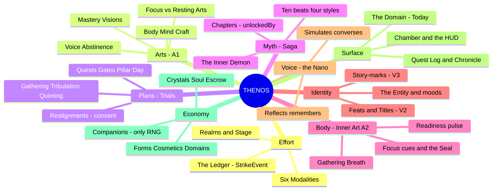
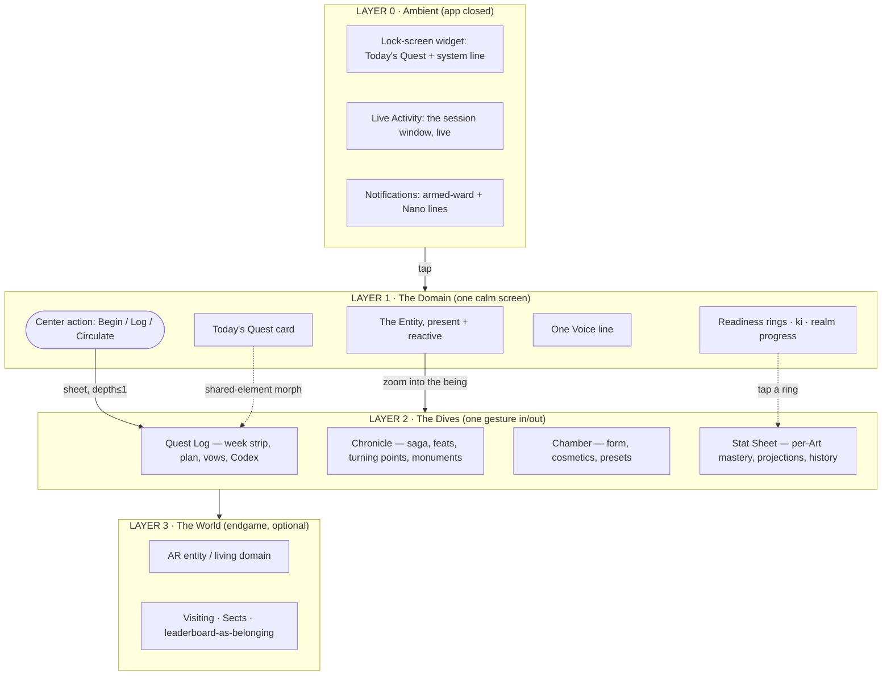
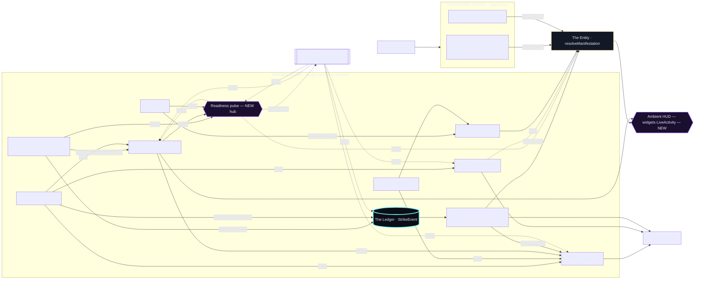
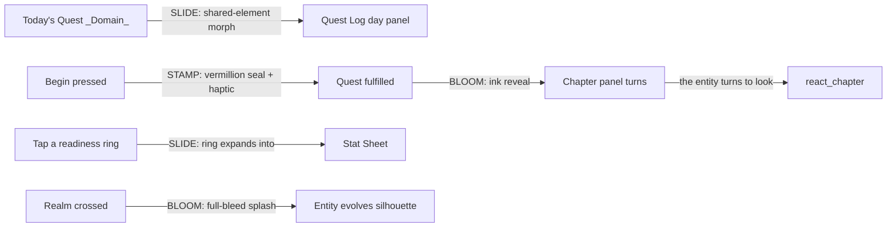
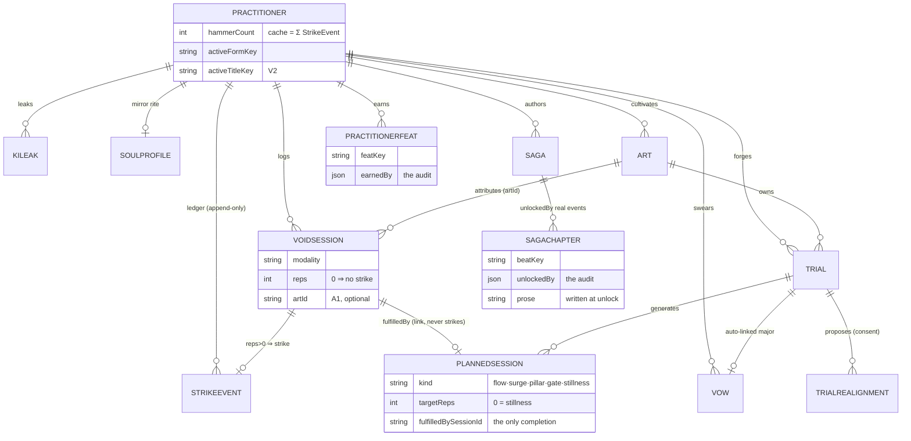
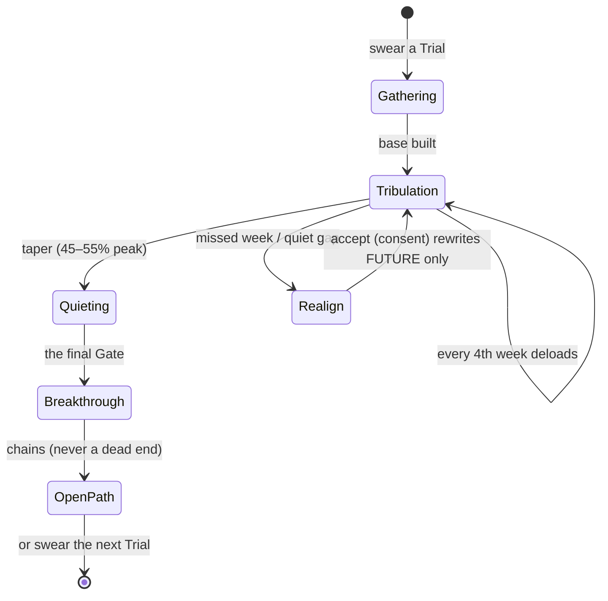
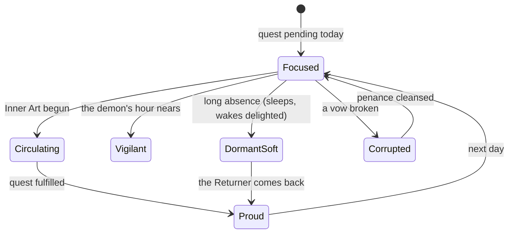
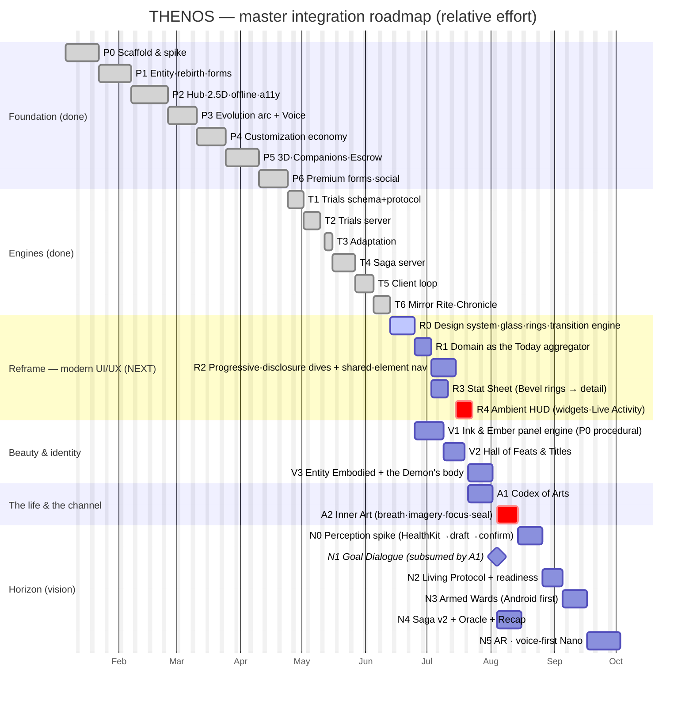
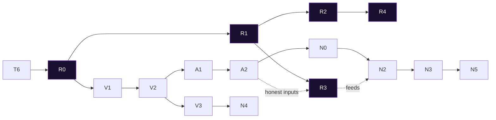

# THE MASTER BLUEPRINT — the super-app, integrated

> The single document that ties everything together. `README.md` is the spec, `GAME_DESIGN.md`
> the design, `docs/CONCEPT_GRAPH.md` the anatomy, `docs/EXPERIENCE_STANDARD.md` the quality bar,
> `BUILD_PROMPT.md` the order, `NANO_VISION.md` the horizon. **This** is the map of how every faculty
> connects into one organism, the modern UI/UX reframe that makes the depth feel discovered (never
> removed, never forced), and the Gantt-charted plan to ship it. Reading order for a newcomer:
> README → GAME_DESIGN → this → CONCEPT_GRAPH → EXPERIENCE_STANDARD.
>
> **Diagrams are Mermaid** — they render on GitHub and in most IDEs. Nothing here changes a law in
> `CLAUDE.md`; it integrates them.

---

## 0. The reframe in one breath

THENOS is no longer "a fitness app with a story." It is a **super-app for self-cultivation**: many
life-projects (Arts), each with a periodized plan (Trials), a living myth (Saga), a biometric pulse
(Readiness/Inner Art), earned identity (Feats/Titles/marks), an evolving being (the Entity), and an
economy of expression — all minted from **one fair ledger**. The job of this blueprint is to make
those faculties feel like one body, and to make the interface as clean, modern, and seamless as the
best apps in the category while **hiding nothing and removing nothing** — depth is *disclosed*, not
deleted.

The aesthetic target, distilled from the references:

> **A calm "Today" that reads at a glance (Bevel) · a plan that expands only when asked (Runna) ·
> wrapped in a glowing system-window skin (the isekai system app).** Dark, translucent
> "system-glass," one accent that flexes per Art-style, data rendered as rings and bloom — not as
> walls of text.

---

## 1. The super-app, as faculties (mindmap)



*Every branch already exists in the docs. The blueprint's contribution is the connective tissue
between them (§4) and the modern shell that surfaces them without clutter (§2–3).*

---

## 2. The modern aesthetic — the North Star

Three references, three lessons, one synthesis.

| Reference | What it nails | What THENOS takes |
|---|---|---|
| **Solo-Leveling "System" app** | The skin we already want: navy-black + cyan glow, translucent panels, a Rank/Level card, a monospace countdown, a DAILY QUEST list with circular check-buttons, Leaderboard, Profile stats. | Validates **system-glass** as the core material; the isekai ink-style; quests as glowing rows; rank/level framing for realms; profile-as-stat-sheet. |
| **Bevel** | The calm aggregator: a single **"Today"** screen of ring gauges (Strain/Recovery/Sleep), one coaching sentence, a stress arc, an energy bar, glanceable health tiles, and a tab bar with a center **+** FAB. | The **Readiness pulse** rendered as rings; the "one coaching line" = the Voice; **everything important on one calm screen**; the center-FAB as the universal "log/Begin/Circulate" action. |
| **Runna** | The legible plan: a **Week N/16** selector, a horizontal day-strip with status dots, **"Today's workouts"** card, gradient action cards, **"EXPAND >"** progressive disclosure, a Week Overview with progress bars. | The Quest Log's week-strip + day dots; **EXPAND-on-demand** as the disclosure verb; phase/week progress bars; gradient cards keyed to the active Art-style. |

**The synthesized look (extends `GAME_DESIGN §11` Ink & Ember):**

- **Material:** `system-glass` everywhere on chrome and instrument surfaces — translucent dark panels, hairline edges, a soft inner glow in the active accent. `ink-wash` for story panels. `foil` for gates/titles/trophies.
- **Color:** the void-dark base is the paper; **one accent flexes per Art / saga style** (murim vermillion, isekai system-blue, tower brass, regression violet). The accent drives rings, glows, and the phase grade — the whole app changes temperature with your focus.
- **Data as shape, not text:** readiness, ki, realm progress, adherence, mastery → **rings, arcs, bloom, spark-lines** (Bevel's lesson). Numbers that matter get a tabular display cut and count up.
- **Glanceable first:** the Domain answers "what now?" in under a second; detail lives one move deeper.

---

## 3. Information architecture — progressive disclosure (nothing removed)

The user's constraint: *clean it up, but move content to the back end / disclose it — never delete
it, never make the disclosure feel forced.* The answer is a **four-layer IA** where every existing
element keeps a home; it just moves to the layer that matches how often it's needed.



**The "Nothing Removed" relocation ledger** — every current surface element, and where it lives in
the modern IA (so the audit is explicit):

| Today it sits on… | …it moves to | Disclosure mechanism |
|---|---|---|
| Domain: entity, realm progress | **L1** (stays — the hero) | always visible |
| Domain: the Voice reflection (full paragraph) | **L1** one line + **L2** full on tap | truncate-to-tap (Bevel coaching pattern) |
| Domain: "Log training" button | **L1** center **FAB** (Begin / Log / Circulate) | one action, context-aware |
| TopStatus: realm sigil, ki bar, streak, pending count | **L1** as **rings** + a thread glyph | rings replace bars (Bevel) |
| Quest Log: phase banner + week strip + day panel | **L2 / QL** (stays — Runna model) | week selector + EXPAND |
| Quest Log: full plan, all weeks | **L2 / QL** behind the week selector | swipe weeks, not one long scroll |
| Quest Log: Binding Vows | **L2 / QL** collapsible section (kept) | accordion |
| Quest Log: Codex / Art switcher (A1) | **L2 / QL** top stratum | horizontal Art cards |
| Chronicle: saga + chapters | **L2 / CH** as illustrated panels | tap a panel to read |
| Chronicle: monuments (shrines/trophies/records) | **L2 / CH** "Monuments" section (kept) | scroll/section |
| Realm thresholds table, hammer math | **L2 / Stat Sheet** + the rings | tap a ring → detail |
| Companion utilities, cosmetic catalog | **L2 / Chamber** (kept) | grid + preview |
| Settings, perception toggles, exports (N) | **L2 / Profile sheet** | gear from L1 corner |

*Net effect:* the Domain goes from "entity + countdown + paragraph + button" to "entity + a ring of
living data + one quest + one line + one action" — Bevel-calm — while **100% of content remains
reachable** in ≤ 1 gesture. The day the Quest Log becomes a painting, the instrument is lost; the
Domain is the calm aggregator, the dives keep their density.

---

## 4. The connectivity master map (the organism)

The full graph, grouped by the **two-graphs-one-membrane** topology (purchased vs. earned, meeting
only at the resolver) and threaded by the **six laws** (`CONCEPT_GRAPH §1`). Bold the new edges this
blueprint adds (§12).



**The edge taxonomy (how to read the arrows):**

| Edge class | Meaning | Law |
|---|---|---|
| **Derivation** (solid → into ENT/HC/RDY/CHRON) | computed live from truth, never stored | L1 |
| **Audit** (`fulfilledBy`/`unlockedBy`/`earnedBy`) | celebration points back at the rows that minted it | L2 |
| **Consent** (Realignment accept, focus switch, reforge) | nothing restructures the world uninvited | L3 |
| **Resolver-only** (purchased → ENT) | money touches appearance, never progression | L4 |
| **Ownership** (Art → systems, A1) | an Art organizes existing nodes; the hammer stays singular | L1 |
| **Bidirectional mind⇄body** (Inner Art, A2) | the only two-way edge — priming out, interoception back | L6 |
| **Ambient** (ENT/TR → HUD, *new*) | connectivity reaches outside the app, consent-armed | L5/N |

**The shape that matters:** every form of effort funnels through one transactional waist
(`server/src/lib/sessionLog.ts`) and fans into every celebration system. There is no second door —
which is *why* the app cannot contradict itself, and why "insane connectivity" is safe: it's all
derived from one honest source.

---

## 5. Seamless transitions = connectivity, made visible

The modern ask — "seamless transitions with insane connectivity" — has a precise answer: **animate
the edges of §4.** When data flows from node A to node B, the UI should *move* from A to B. Three
motion verbs (`EXPERIENCE_STANDARD §4`), now bound to graph edges:



| Verb | Edge it visualizes | Implementation |
|---|---|---|
| **Slide** (shared-element) | navigation / drill-in along an ownership or disclosure edge | the tapped card *becomes* the destination header (React Navigation shared element / Reanimated layout) — Runna→detail feel |
| **Bloom** (ink) | an audit edge firing — something earned reveals | chapter/feat/realm unlocks; one frame of white, then ink spreads |
| **Stamp** (seal) | a commit — a real row written | quest fulfilled, vow kept, ward held, circulation sealed |

**Rules that keep it seamless (not flashy):** one verb per event; every verb has a reduce-motion
calm variant (crossfade + same haptic, invariant #7); ≤ 250ms springs from tokens only; **never
block input** during motion; the entity is the constant that carries continuity across every
transition (it's the one element present in every layer). Shared-element morphs make the four
"spaces" feel like **views of one being** rather than tabs — the navigation itself expresses the
graph.

---

## 6. Data-model interconnections (built + specced)



*Derived, never stored (so absent here): realm, stage, phase, week, adherence, mood, demon scale,
per-Art mastery, readiness, panel art — all recomputed from the rows above (L1). The ER diagram is
deliberately small; the richness is in the derivations.*

---

## 7. The runtime cascade — one tap, modernized (sequence)

```mermaid
sequenceDiagram
  actor U as Practitioner
  participant D as Domain (L1)
  participant ST as Stores (optimistic)
  participant Q as Offline Queue
  participant SL as logSession (the waist)
  participant FAN as Event fan
  participant UI as Surfaces + Entity

  U->>D: tap Begin on Today's Quest
  opt Inner Art (A2, skippable ≤2 taps)
    D->>U: Gathering Breath → Intent Circulation → focus cue
  end
  U->>D: confirm reps
  D->>ST: optimistic strike (hammer/streak/realm recompute, quest marked)
  ST-->>UI: 0ms — rings move, seal STAMPS, entity react_quest
  ST->>Q: enqueue {clientId, plannedSessionId}
  Q->>SL: POST /sync/flush
  SL->>SL: idempotency → session row → strike → fulfill link
  SL->>FAN: emit events (fulfilled·gate·phase·realm·streak·feat)
  FAN->>FAN: advanceSaga unlocks chapter (unlockedBy) + award feats
  SL-->>ST: authoritative reconcile (ledger wins)
  FAN-->>UI: BLOOM new chapter panel · feat medallion · Voice line
  Note over UI: offline? steps 1–2 + UI run from cache;<br/>flush replays later, idempotent — no drift
```

This is the §4 graph in motion and the §5 verbs in sequence: **instant local truth, eventual server
truth, zero contradiction** — the technical meaning of "insane connectivity."

---

## 8. State machines (the predictable surfaces)

**Trial phase lifecycle** (derived from `startDate` + params — never stored):



**Entity mood** (computed, never stored — `GAME_DESIGN §13.2`, +`circulating` from A2):



Every L2 surface implements the **eight UI states** (`EXPERIENCE_STANDARD §2`): cold/empty/offline/
pending/error/success/reduced-motion/stale — the matrix with no blank cells is the definition of
"done," and the reason the modern shell feels dependable rather than merely pretty.

---

## 9. The build plan — Gantt (the integration roadmap)

Effort-phased, not calendar-bound; durations are **relative effort estimates** on a notional
timeline. `done` = shipped this project; the rest is sequenced by dependency. The **Reframe (R)**
track is the new UI/UX modernization this blueprint proposes; it interleaves with V1.



**Dependency flowchart (the critical path, since a Gantt linearizes):**



**Critical path to "modern super-app, fully alive":** `T6 → R0 → R1 → R2 → R4` (the clean modern
shell + ambient reach) running parallel to `R0 → V1 → V2 → V3` (the beautiful living skin), then
`A1 → A2` (the life + the body), then the `N` horizon. **R0 is the gate for everything** — the
design system, system-glass materials, ring components, and the shared-element transition engine
are the substrate the rest paints on. Start there.

---

## 10. The day-in-the-life (journey — proof the connectivity is felt, not filed)

```mermaid
journey
  title A day as the practitioner feels it
  section Morning (glance)
    Widget shows Today's Quest: 5: You
    Open app → Domain: entity stretches, rings full: 5: You, Entity
  section Train (one action)
    Tap Begin → Gathering Breath → Circulation: 4: You, Entity
    Strike → seal STAMPS, rings move, hammer ticks: 5: You, Entity
  section Reward (discovered, not nagged)
    A chapter BLOOMS — the Chronicle turned: 5: You, Entity
    A feat medallion lights; a Title offered: 5: You
  section Evening (the war within)
    The demon looms at its hour; the Ward fires: 3: You, Demon
    Ward held → demon recoils, a feat earned: 5: You, Entity
  section Rest (the channel)
    Stillness quest: a guided body-scan, reps:0: 4: You, Entity
    Readiness updates → tomorrow's quest adapts: 5: You, Nano
```

Each step crosses an edge from §4; each transition is a verb from §5. The user never thinks
"systems" — they feel one responsive companion.

---

## 11. The modern super-app patterns, applied

How THENOS adopts the proven shape of best-in-class modern apps — each pattern named, mapped, and
fenced:

1. **One calm home aggregator** (Bevel/Robinhood/Linear) → the Domain (§3 L1). The center-FAB is the
   universal action; the rings are the glance.
2. **Progressive disclosure / mini-modules** (super-apps, Apple Health) → the four-layer IA; Arts are
   the "mini-programs" of a life, each self-contained but sharing the one ledger.
3. **Command surface** (Linear ⌘K, Raycast) → the Nano command line (N): type/speak any intent;
   it routes through the *same* authoritative APIs as buttons (L-safe, no privileged path).
4. **Local-first + optimistic sync** (Linear, Actual) → already the architecture (§7); the modern UI
   simply trusts it — no spinners on effort.
5. **Ambient/glanceable** (Whoop, Apple Fitness) → Layer 0 widgets + Live Activity; the system speaks
   where you already are, consent-armed.
6. **Shared-element continuity** (iOS, modern RN) → §5; navigation *is* the connectivity animation.
7. **Themeable accent / dynamic identity** → the accent flexes per Art/style; the app's temperature
   is *yours*, which is both modern and on-theme.

---

## 12. New interconnections this blueprint adds (the register)

The user invited "any more you deem fit." Each below is additive, law-abiding, and slots into an
existing seam (`CONCEPT_GRAPH §5`) — no rewiring.

| # | New interconnection | What it links | Why it deepens the app | Law / seam |
|---|---|---|---|---|
| **C1** | **The Readiness Pulse** as a first-class hub node | sessions + sleep/HRV + sealed Inner sessions + streak → one derived `readiness` | Bevel's lesson: a single daily pulse the user trusts; it paces the quest, sets entity mood, gives the Voice an honest input, and tells the demon when you're vulnerable. Turns scattered signals into one legible heartbeat. | L1 derive; seam: serialize layer |
| **C2** | **The "Today" aggregator** as the universal entry | entity + readiness + Today's Quest + Voice + FAB on one surface | Collapses four scattered reads into one glance; the modern home. Everything else is disclosed from here. | IA §3; no new data |
| **C3** | **Shared-element transitions as edges** | every nav edge animates the data edge it represents | Makes connectivity *felt*; the four spaces become views of one being. | §5; motion grammar |
| **C4** | **The Constellation** — multi-Art visualization | Arts (A1) ↔ the one realm | When a life holds several Arts, show them as a constellation whose overall brightness is the whole-person realm; each star a mastery curve. Connectivity you can see. | L1; Stat Sheet surface |
| **C5** | **The Ambient layer** as connective tissue outside the app | entity/trial/Voice → widgets, Live Activity, watch | Connectivity escapes the app bezel; the system reaches you in life (consent-armed). | L5/N3; seam: snapshot |
| **C6** | **Readiness ⇄ Inner Art loop closed** | A2 sealed sessions feed C1; C1 paces tomorrow | The mind→body→readiness→plan→mind loop becomes a visible cycle, not a one-shot. | L6 bidirectional edge |
| **C7** | **Cross-faculty "moments"** | a feat + a chapter + a realm crossing that coincide compose into one **set-piece** | Prevents celebration spam (a tension named in `CONCEPT_GRAPH §7`): when several fire at once, the Recap composer merges them into a single, bigger beat. | L2; pacing rule |

---

## 13. Guardrails — keeping connectivity honest as it grows

Density is a risk, not just a virtue. The six laws are the brakes; this blueprint adds operational
rules so "insane connectivity" never becomes incoherence:

- **The waist stays thin.** `logSession` orchestrates; every rule lives in a pure lib it *calls*.
  New edges subscribe to the event fan — they never open a second write door.
- **Beauty renders the ledger, never replaces it** (invariant #16). Rings, blooms, constellations
  illustrate real rows; a readout is never decorative-only.
- **One verb per event; celebrations compose** (C7). The Chronicle is a museum, not a slot machine.
- **Disclosure, not burial.** Every relocated element (§3 ledger) stays reachable in ≤ 1 gesture; the
  Seamlessness Audit (`EXPERIENCE_STANDARD §9`) adds a "depth ≤ 1 / nothing-orphaned" check.
- **The world stays self-contained** (L6/invariant #17). Connectivity never leaks a source name or a
  clinical claim into the UI; the Voice cites only the practitioner's own ledger.
- **Every new surface ships its offline snapshot** (L5). If it isn't in `/sync/state` + a persisted
  store, it doesn't exist on the subway — the non-negotiable that keeps the super-app trustworthy.

---

### Appendix — document map

| Question | Document |
|---|---|
| What is it? | `README.md` |
| Why is it designed this way? | `GAME_DESIGN.md` (§1–15) |
| **How does it all connect, look modern, and ship?** | **this — `docs/MASTER_BLUEPRINT.md`** |
| How do the concepts interconnect in code? | `docs/CONCEPT_GRAPH.md` |
| How must it feel (states, latency, motion, copy)? | `docs/EXPERIENCE_STANDARD.md` |
| In what order do we build? | `BUILD_PROMPT.md` |
| Where is it going? | `NANO_VISION.md` |
| What's verified vs pending? | `docs/STATUS.md` |
